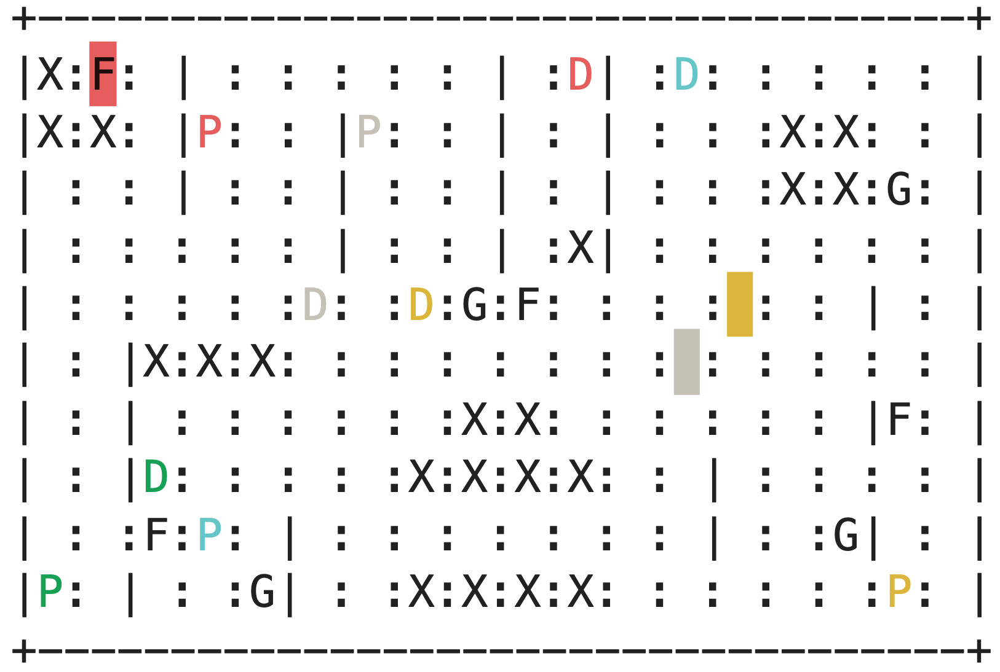

# Multi Taxi Environment

<p>
    
</p>

`multi_taxi` is a highly configurable multi-agent environment, based on [gym](https://www.gymlibrary.ml/)'s
[taxi environment](https://www.gymlibrary.ml/environments/toy_text/taxi/), that adheres to the
[PettingZoo](https://www.pettingzoo.ml/) API. Some configurations include:
1. the number of taxis and passengers in the environment (limited to the size of the map)
2. the domain map itself
3. the environment objective
4. individual taxi configurations:
   1. reward function
   2. action and observation space
   3. passenger and fuel capacity
5. and so much more!

For a quickstart guide and a deeper dive into the environment and its configuraions, please consult our
[demonstration notebook](https://github.com/sarah-keren/multi_taxi/blob/main/MultiTaxiEnvDemo.ipynb), also available in
[colab](https://colab.research.google.com/github/sarah-keren/multi_taxi/blob/main/MultiTaxiEnvDemo.ipynb).
 
# Installation
The easiest way to install `multi_taxi` is directly from the git repository using `pip`. Here is how to install the
latest stable version:
```bash
pip install "git+https://github.com/sarah-keren/multi_taxi@0.1.0"
```

You can also download our latest updates by not specifying a tag, like so:
```bash
pip install "git+https://github.com/sarah-keren/multi_taxi"
```


If you are seeking the legacy version, which is based on the [RLLib](https://docs.ray.io/en/latest/rllib/index.html)
API, please install version `0.0.0` like so:
```bash
pip install "git+https://github.com/sarah-keren/multi_taxi@0.0.0"
```

# Acknowledgements
This library is based on [MultiTaxiLib](https://github.com/ofirAbu/MultiTaxiLib) by Ofir Abu. The original
implementation paper can be found [here](https://github.com/ofirAbu/MultiTaxiLib/blob/master/MultiTaxiLabProject.pdf). 

# Citation
To cite this repository in academic works or any other purpose, please use the following citation:
```
@misc{SSDOpenSource,
    author = {[Guy Azran, Sarah Keren]},
    title = {Multi Taxi: A Modular Setting for Multi-Agent Systems Experiments},
    year = {2021},
    publisher = {GitHub},
    note = {GitHub repository},
}
```
